# Job Hunt

A Linear-inspired job application tracker built with Next.js 16 and Firebase.

## Features

- Add jobs via URL (auto-scrapes title, company, location) or manual form
- Markdown editor for job description and notes/timeline
- Kanban board with drag-and-drop status columns
- Table view with inline status updates
- Command palette (⌘K) to search across all jobs
- Status timeline history per job
- Contacts per job with email/LinkedIn
- Stats page: funnel, source breakdown, tag cloud, KPIs
- CSV export
- Google + email auth
- Real-time Firestore sync

## Screenshots

| Title & Description | Screenshot |
|---------------------|------------|
| **Main Dashboard**<br>Overview of application metrics and recent activities. | 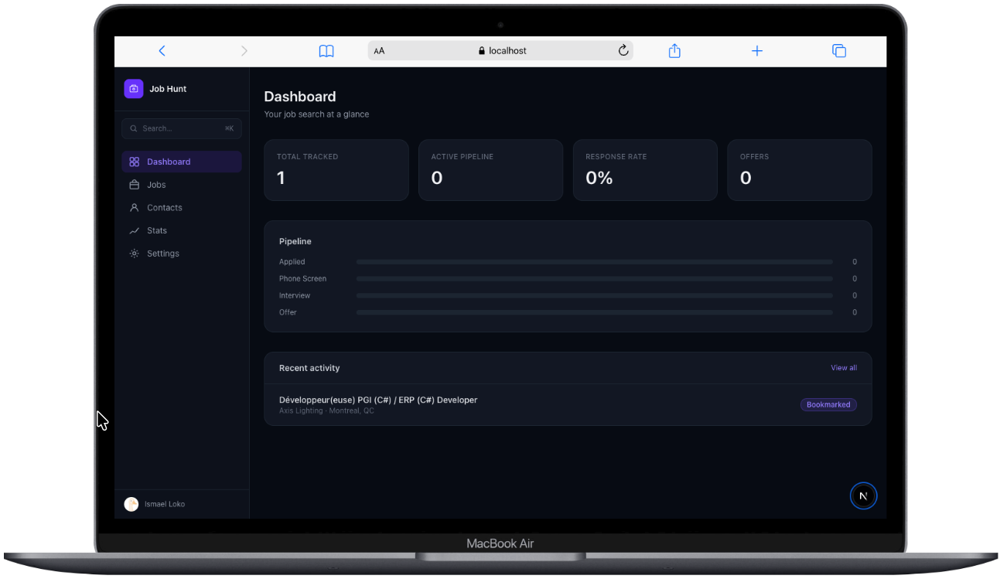 |
| **Command Palette**<br>Global search using Cmd+K to quickly find jobs and contacts. | 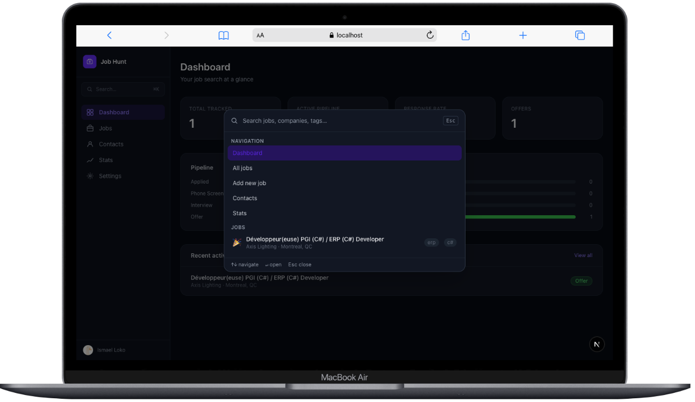 |
| **Jobs List - Kanban View**<br>Drag and drop jobs across different status columns. | 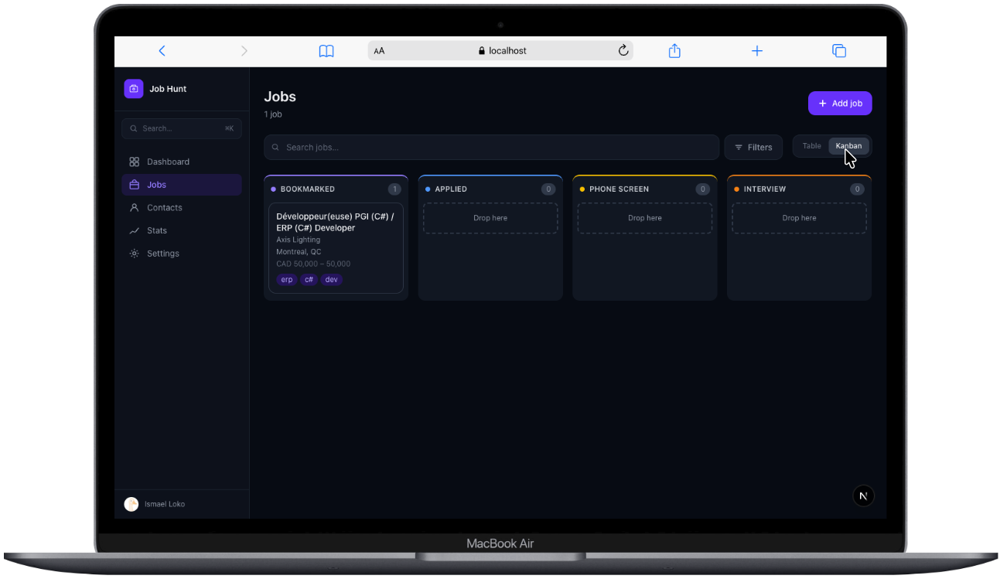 |
| **Jobs List - Table View**<br>A structured table view of all your tracked jobs. | 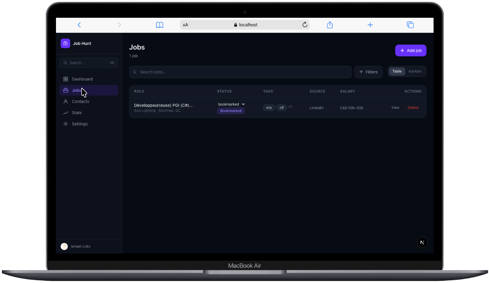 |
| **Job List Filters**<br>Advanced filtering and search options for your applications. | 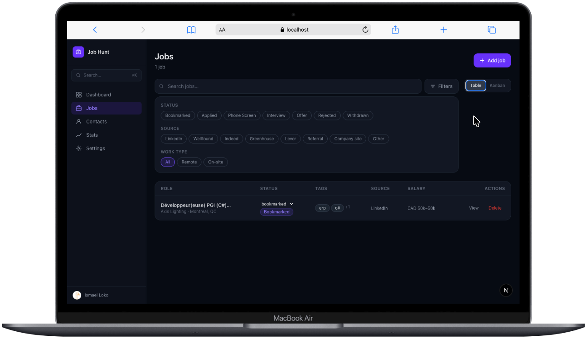 |
| **Job Details Page**<br>Comprehensive view of a specific job application. | 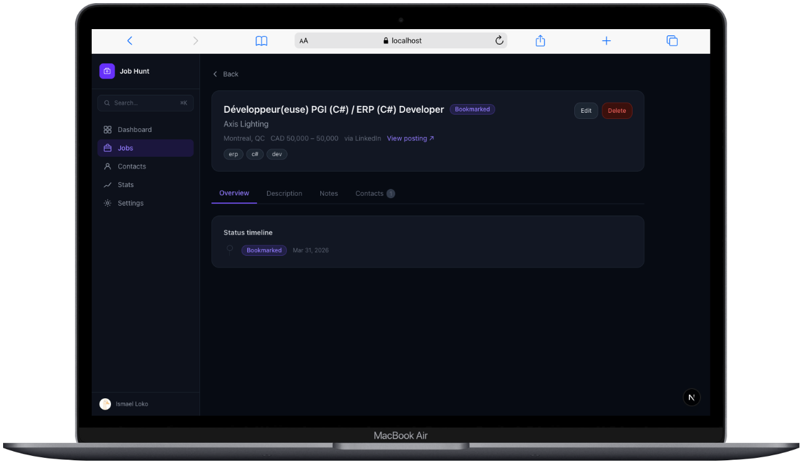 |
| **Job Status Timeline**<br>A history timeline showing the status evolution for a job. | 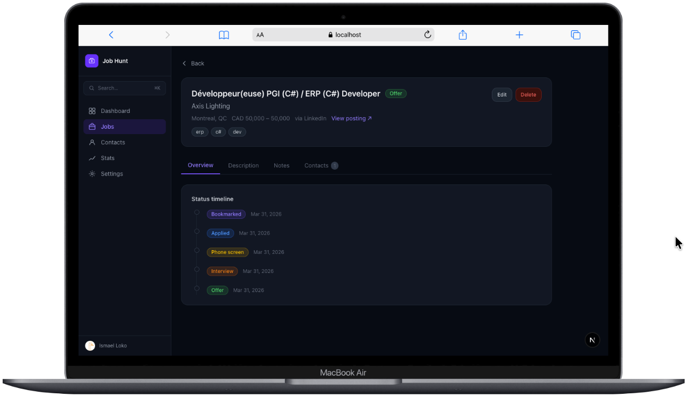 |
| **Add Job Form**<br>Track a new job application by filling out its basic details. | 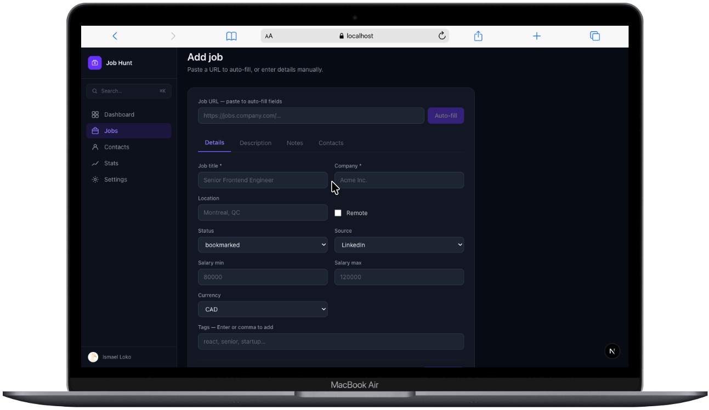 |
| **Add Job - Description**<br>Markdown editor to save the job description. | 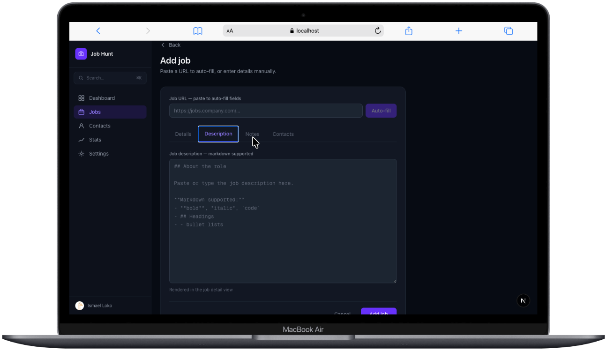 |
| **Add Job - Notes**<br>Markdown editor to log interview notes and reflections. | 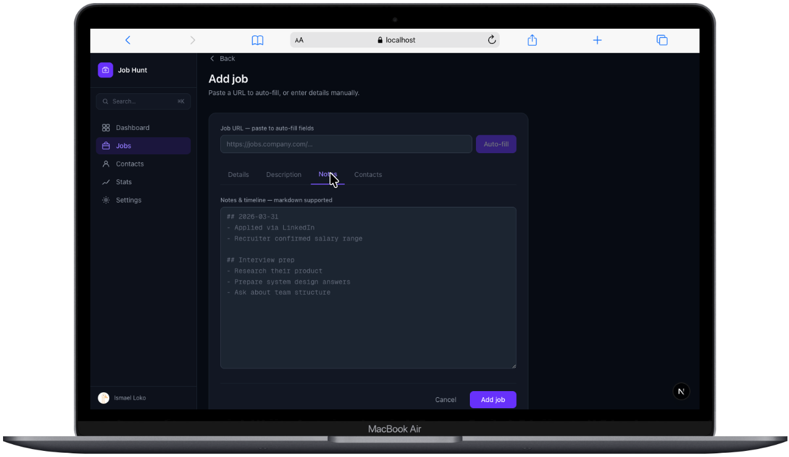 |
| **Add Job - Contacts**<br>Manage recruiter and employee contacts for the role. | 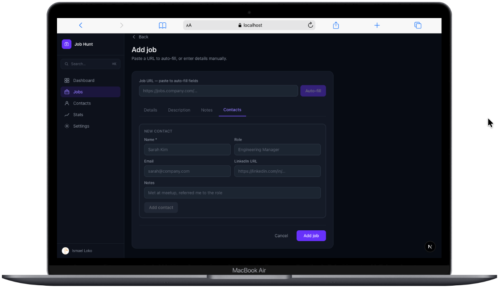 |
| **Contact Directory**<br>A consolidated list of all your networking contacts. | 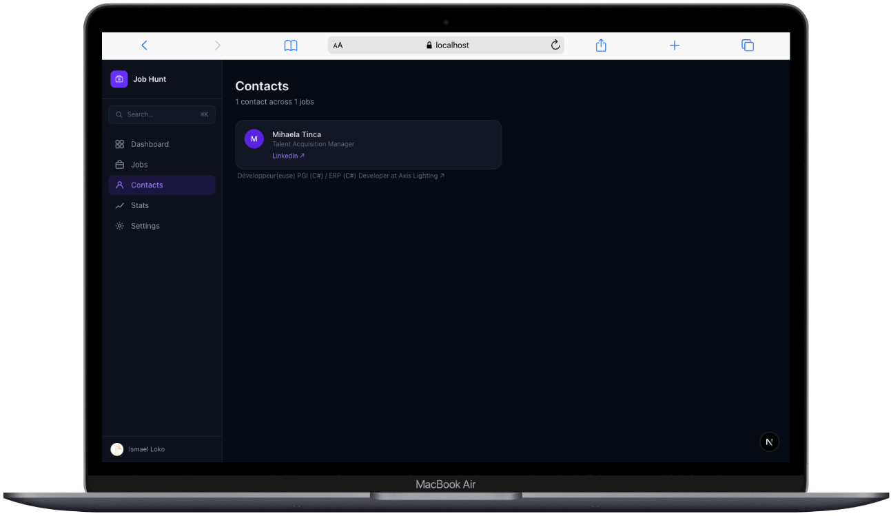 |
| **Statistics & Charts (1)**<br>Visual breakdowns and metrics of your job hunt performance. | 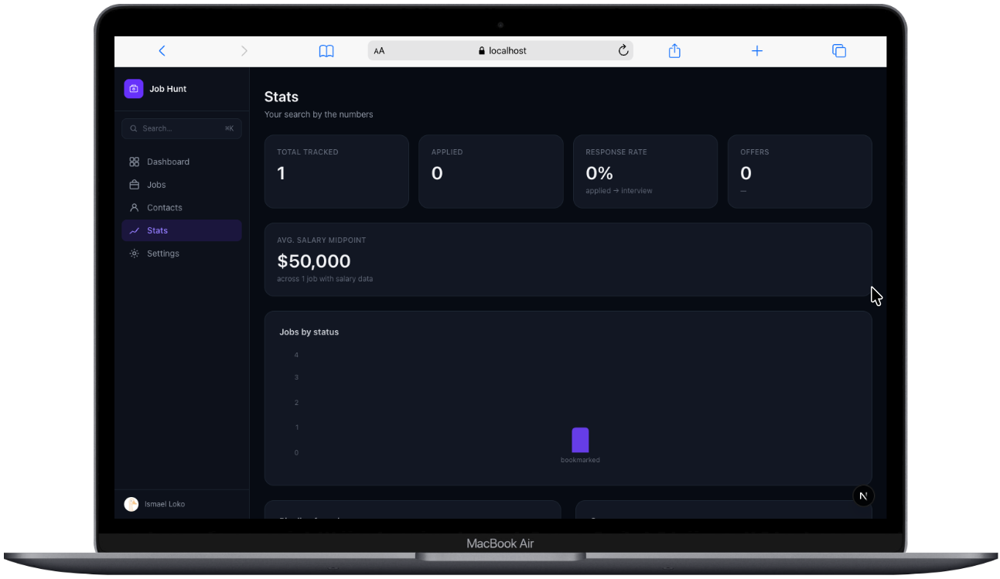 |
| **Statistics & Charts (2)**<br>Application funnel and more detailed analytics. | 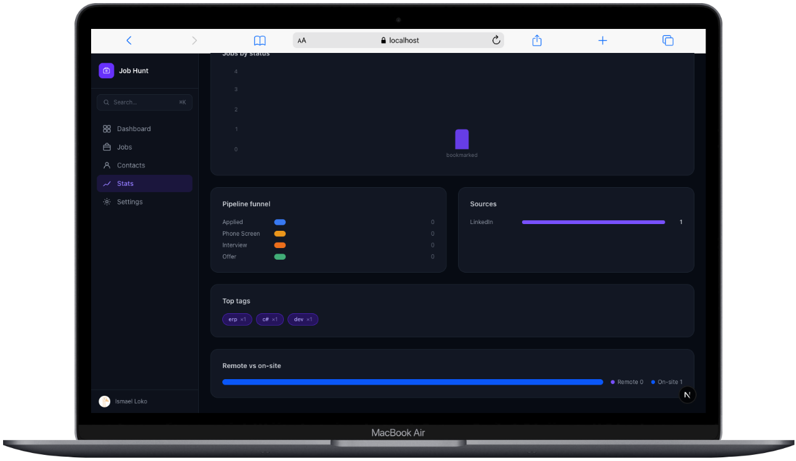 |
| **Settings**<br>Manage application preferences and account options. | 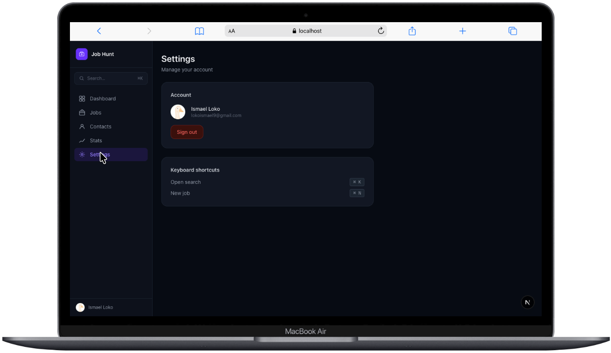 |

## Stack

- **Framework**: Next.js 16 (App Router)
- **Backend**: Firebase (Firestore, Auth, Storage)
- **Styling**: Tailwind CSS
- **Drag & drop**: @dnd-kit
- **Search**: cmdk
- **Charts**: recharts

## Setup

### 1. Create the Next.js app

```bash
npx create-next-app@latest job-hunt --typescript --tailwind --app --src-dir=no --import-alias="@/*"
cd job-hunt
```

### 2. Install dependencies

```bash
npm install firebase @dnd-kit/core @dnd-kit/sortable @dnd-kit/utilities cmdk recharts
```

### 3. Set up Firebase

1. Go to [Firebase Console](https://console.firebase.google.com) → New project
2. Enable **Firestore** (production mode)
3. Enable **Authentication** → Google + Email/Password
4. Enable **Storage**
5. Copy your web app config

### 4. Configure environment

```bash
cp .env.local.example .env.local
# Fill in your Firebase values
```

### 5. Deploy Firestore rules and indexes

```bash
npm install -g firebase-tools
firebase login
firebase init   # select Firestore, use existing project
firebase deploy --only firestore
```

### 6. Copy source files

Drop all files from this repo into your Next.js project maintaining the folder structure.

### 7. Run

```bash
npm run dev
```

Open [http://localhost:3000](http://localhost:3000).

## Folder structure

```
job-hunt/
├── app/
│   ├── (auth)/
│   │   ├── login/page.tsx
│   │   └── layout.tsx
│   ├── (dashboard)/
│   │   ├── layout.tsx              ← sidebar + topbar shell
│   │   ├── page.tsx                ← dashboard overview
│   │   ├── jobs/
│   │   │   ├── page.tsx            ← job list (table + kanban toggle)
│   │   │   ├── [id]/page.tsx       ← job detail
│   │   │   └── new/page.tsx        ← add job (URL or manual)
│   │   ├── contacts/page.tsx       ← people at companies
│   │   ├── stats/page.tsx          ← charts, funnel, heatmap
│   │   └── settings/page.tsx
│   └── api/
│       ├── scrape/route.ts         ← URL → job metadata
│       └── export/route.ts         ← CSV export
│
├── components/
│   ├── jobs/
│   │   ├── JobCard.tsx
│   │   ├── JobTable.tsx
│   │   ├── KanbanBoard.tsx
│   │   ├── JobForm.tsx             ← manual entry + markdown editor
│   │   ├── StatusBadge.tsx
│   │   └── TagPill.tsx
│   ├── ui/                         ← shadcn/ui components
│   ├── layout/
│   │   ├── Sidebar.tsx
│   │   └── CommandPalette.tsx      ← Cmd+K search
│   └── shared/
│       ├── MarkdownEditor.tsx      ← for description field
│       └── FilterBar.tsx
│
├── lib/
│   ├── firebase/
│   │   ├── config.ts
│   │   ├── jobs.ts                 ← CRUD operations
│   │   ├── contacts.ts
│   │   └── auth.ts
│   ├── hooks/
│   │   ├── useJobs.ts
│   │   ├── useSearch.ts
│   │   └── useFilters.ts
│   └── utils/
│       ├── scraper.ts
│       └── formatters.ts
│
├── types/
│   └── index.ts                    ← Job, Contact, Tag, Status types
│
└── functions/                      ← Firebase Cloud Functions
    ├── src/
    │   ├── scrapeJob.ts
    │   └── sendReminder.ts
    └── package.json
```

## Keyboard shortcuts

| Shortcut | Action                      |
| -------- | --------------------------- |
| ⌘K       | Open command palette        |
| ⌘N       | New job (wire up in layout) |
| Esc      | Close palette               |

## CSV Export

Call `POST /api/export` with `{ jobs: Job[] }` in the body. Returns a `.csv` file.
Add an export button in the jobs page:

```ts
async function handleExport() {
  const res = await fetch("/api/export", {
    method: "POST",
    headers: { "Content-Type": "application/json" },
    body: JSON.stringify({ jobs: allJobs }),
  });
  const blob = await res.blob();
  const url = URL.createObjectURL(blob);
  const a = document.createElement("a");
  a.href = url;
  a.download = "jobs.csv";
  a.click();
}
```

## Env variables

```ts
NEXT_PUBLIC_FIREBASE_API_KEY = your_api_key;
NEXT_PUBLIC_FIREBASE_AUTH_DOMAIN = your_auth_domain;
NEXT_PUBLIC_FIREBASE_PROJECT_ID = your_project_id;
NEXT_PUBLIC_FIREBASE_STORAGE_BUCKET = your_storage_bucket;
NEXT_PUBLIC_FIREBASE_MESSAGING_SENDER_ID = your_messaging_sender_id;
NEXT_PUBLIC_FIREBASE_APP_ID = your_app_id;
```
