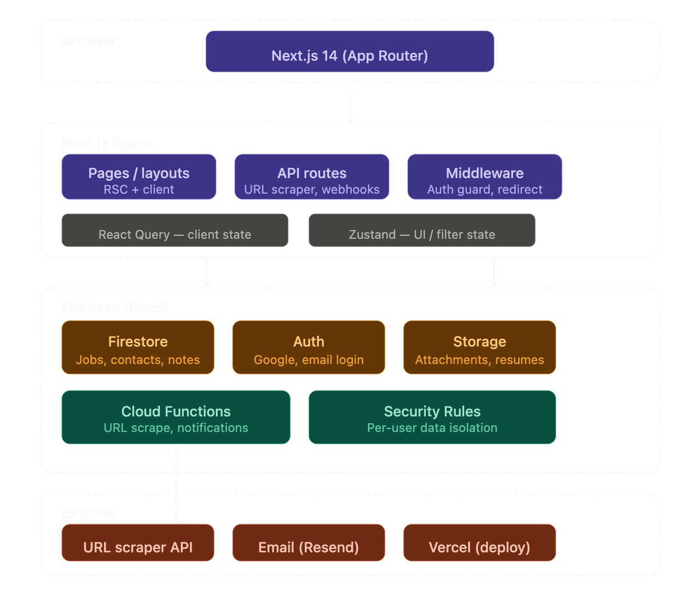

## Tech stack

Here's the full system architecture showing how Next.js and Firebase wire together.



## Folder structure

```
job-hunt/
├── app/
│   ├── (auth)/
│   │   ├── login/page.tsx
│   │   └── layout.tsx
│   ├── (dashboard)/
│   │   ├── layout.tsx              ← sidebar + topbar shell
│   │   ├── page.tsx                ← dashboard overview
│   │   ├── jobs/
│   │   │   ├── page.tsx            ← job list (table + kanban toggle)
│   │   │   ├── [id]/page.tsx       ← job detail
│   │   │   └── new/page.tsx        ← add job (URL or manual)
│   │   ├── contacts/page.tsx       ← people at companies
│   │   ├── stats/page.tsx          ← charts, funnel, heatmap
│   │   └── settings/page.tsx
│   └── api/
│       ├── scrape/route.ts         ← URL → job metadata
│       └── export/route.ts         ← CSV export
│
├── components/
│   ├── jobs/
│   │   ├── JobCard.tsx
│   │   ├── JobTable.tsx
│   │   ├── KanbanBoard.tsx
│   │   ├── JobForm.tsx             ← manual entry + markdown editor
│   │   ├── StatusBadge.tsx
│   │   └── TagPill.tsx
│   ├── ui/                         ← shadcn/ui components
│   ├── layout/
│   │   ├── Sidebar.tsx
│   │   └── CommandPalette.tsx      ← Cmd+K search
│   └── shared/
│       ├── MarkdownEditor.tsx      ← for description field
│       └── FilterBar.tsx
│
├── lib/
│   ├── firebase/
│   │   ├── config.ts
│   │   ├── jobs.ts                 ← CRUD operations
│   │   ├── contacts.ts
│   │   └── auth.ts
│   ├── hooks/
│   │   ├── useJobs.ts
│   │   ├── useSearch.ts
│   │   └── useFilters.ts
│   └── utils/
│       ├── scraper.ts
│       └── formatters.ts
│
├── types/
│   └── index.ts                    ← Job, Contact, Tag, Status types
│
└── functions/                      ← Firebase Cloud Functions
    ├── src/
    │   ├── scrapeJob.ts
    │   └── sendReminder.ts
    └── package.json
```

---

## Firestore data model

```ts
// types/index.ts

type JobStatus =
  | "bookmarked"
  | "applied"
  | "phone_screen"
  | "interview"
  | "offer"
  | "rejected"
  | "withdrawn";

type Job = {
  id: string;
  userId: string;
  title: string;
  company: string;
  location: string;
  remote: boolean;
  url?: string;
  source: string; // LinkedIn, Wellfound, referral, etc.
  status: JobStatus;
  tags: string[]; // ['senior', 'startup', 'react']
  salary?: {
    min: number;
    max: number;
    currency: string;
  };
  description: string; // Markdown
  notes: string; // Markdown timeline
  contacts: Contact[];
  appliedAt?: Timestamp;
  createdAt: Timestamp;
  updatedAt: Timestamp;
};

type Contact = {
  id: string;
  jobId: string;
  name: string;
  role: string;
  email?: string;
  linkedin?: string;
  notes?: string;
};
```

---

## Key features & how to build them

- **Command palette search (Cmd+K)** — use `cmdk` library. Search across job titles, companies, tags all at once.
- **Kanban board** — `@dnd-kit/core` for drag-and-drop between status columns. Each column = one `JobStatus`. Dragging a card updates Firestore instantly.
- **URL scraper** — in `/api/scrape/route.ts`, use `cheerio` + `node-fetch` to pull title, company, location from LinkedIn/Greenhouse/Lever job pages. Populate the form automatically when a URL is pasted.
- **Markdown editor** — use `@uiw/react-md-editor` for both the job description and the notes/timeline field. The notes field works like a running log — new entries prepend with a timestamp.
- **Status timeline** — every status change gets written to a `statusHistory` subcollection in Firestore so you can see the full journey per job.
- **Stats page** — use `recharts` for a sankey/funnel of your pipeline, an application heatmap calendar, and a response rate metric.

---

## UI design tokens (Linear-like)

```ts
// tailwind.config.ts — extend colors
colors: {
  brand: '#5E6AD2',      // Linear purple-blue
  surface: '#1A1A1A',    // dark card bg
  border: '#2A2A2A',
  status: {
    bookmarked: '#6366F1',
    applied:    '#3B82F6',
    interview:  '#F59E0B',
    offer:      '#10B981',
    rejected:   '#EF4444',
    withdrawn:  '#6B7280',
  }
}
```

Use `shadcn/ui` as the base component library, override with the tokens above. Dark mode by default.

---

## Suggested build order

Start with: Firebase config + auth → job CRUD (Firestore) → job list page → job detail page → add job form (manual first) → URL scraper → Kanban view → Command palette → Stats page.
